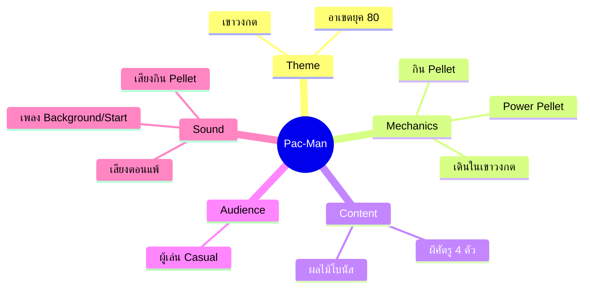
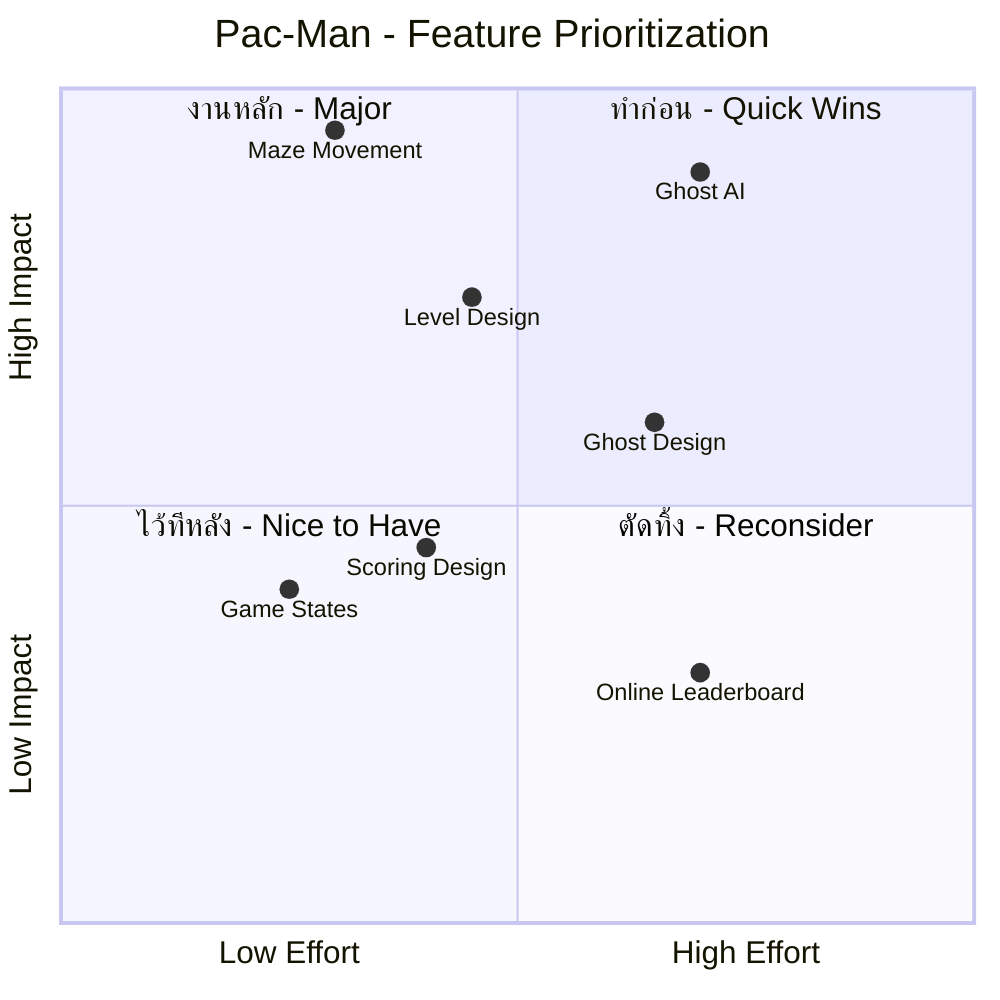
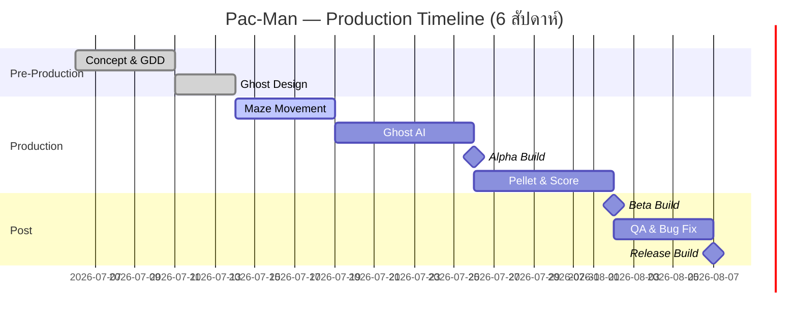

```mermaid
mindmap
    root((Pac-Man))
        Theme
            เขาวงกต
            อาเขตยุค 80
        Mechanics
            เดินในเขาวงกต
            กิน Pellet
            Power Pellet
        Content
            ผีศัตรู 4 ตัว
            ผลไม้โบนัส
        Audience
            ผู้เล่น Casual
        Sound
            เสียงกิน Pellet
            เสียงตอนแพ้
            เพลง Background/Start
```
---

```mermaid
quadrantChart
    title Pac-Man - Feature Prioritization
    x-axis Low Effort --> High Effort
    y-axis Low Impact --> High Impact
    quadrant-1 ทำก่อน - Quick Wins
    quadrant-2 งานหลัก - Major
    quadrant-3 ไว้ทีหลัง - Nice to Have
    quadrant-4 ตัดทิ้ง - Reconsider
    Maze Movement: [0.3, 0.95]
    Ghost AI: [0.7, 0.9]
    Online Leaderboard: [0.7, 0.3]
    Ghost Design: [0.65, 0.6]
    Game States: [0.25, 0.4]
    Level Design: [0.45, 0.75]
    Scoring Design: [0.4, 0.45]
```

MVP: Level Design, Ghost Design, Ghost AI

ตัดออกก่อน: Online Leaderboard

---

```mermaid
gantt
    title Pac-Man — Production Timeline (6 สัปดาห์)
    dateFormat YYYY-MM-DD
    section Pre-Production
    Concept & GDD :done, c1, 2026-07-06, 5d
    Ghost Design :done,c2, after c1, 3d
    section Production
    Maze Movement :active, p1, after c2, 5d
    Ghost AI : p2, after p1, 7d
    Alpha Build :milestone, m1, after p2, 0d
    Pellet & Score : p3, after p2, 7d
    section Post
    Beta Build :milestone, m2, after p3, 0d
    QA & Bug Fix : q1, after p3, 5d
    Release Build :milestone, m3, after q1, 0d
```